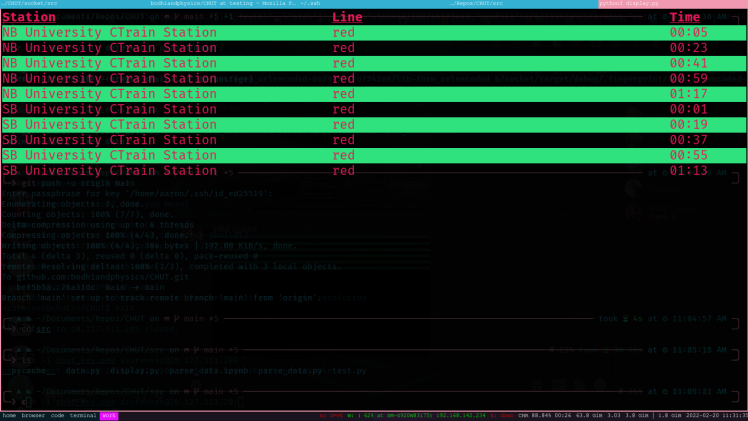

# CHUT Transit App

This is the main repo for the CHUT Transit App by CHUT for Calgary Hacks 2022.


## Cloning the repo

```bash
git clone git@github.com:bodhiandphysics/CHUT.git
```

# Running the client

Go into `CHUT/src` and run:

```bash
python3 display.py
```



# Running the server

**THIS IS MEANT TO BE DONE ON AN AZURE SERVER**

cd into `socket/src` and then:
```bash
cargo run
```

# Json Format

```json
[
  {
    "year": 2022,
    "month": "Feb",
    "day": "17",
    "hour": "10",
    "minute": "30",
    "direction": "nb"
    "line": "Red"
    "station": "university",
  },
  {
    "year": 2022,
    "month": "Feb",
    "day": "17",
    "hour": "10",
    "minute": "30",
    "direction": "sb"
    "line": "Red"
    "station": "university",
  }
]
```

